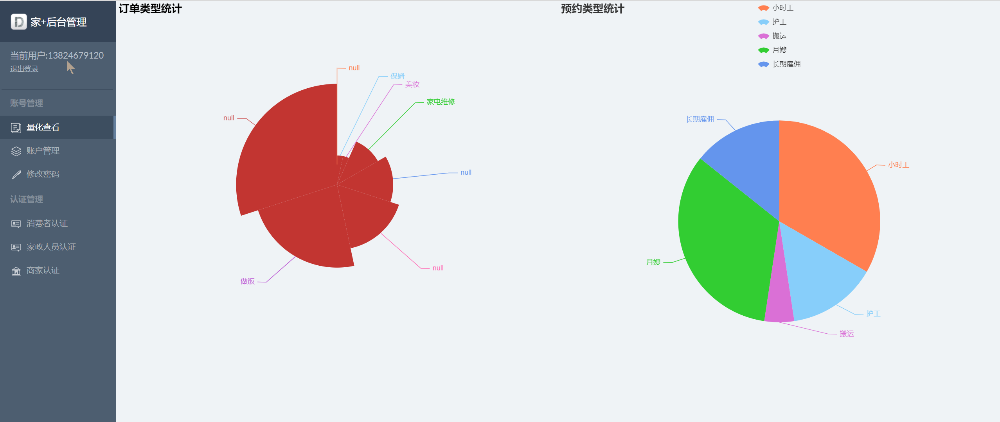
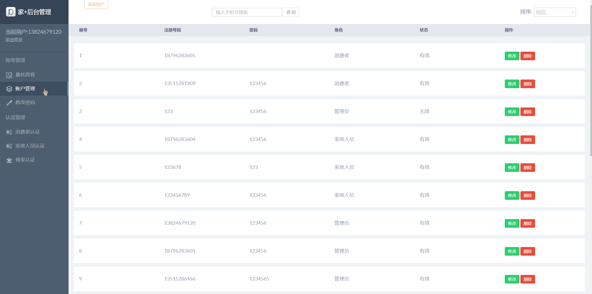
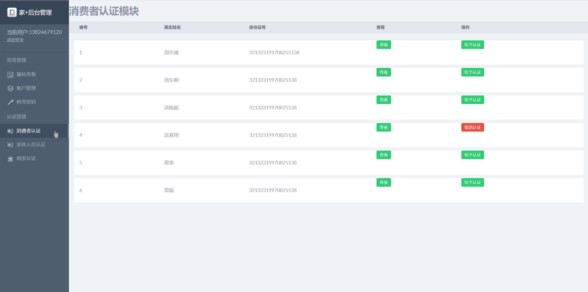
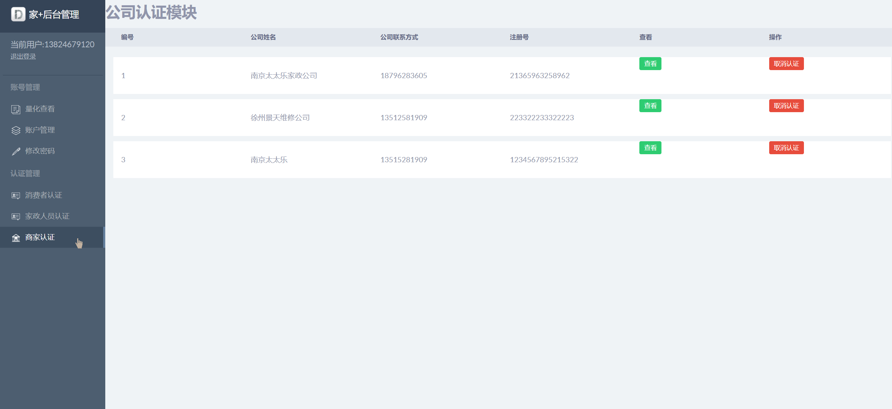
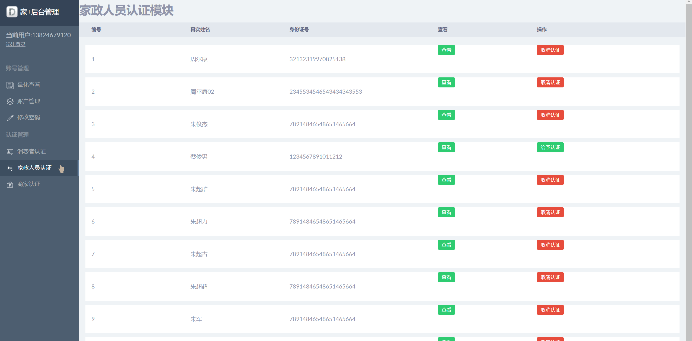
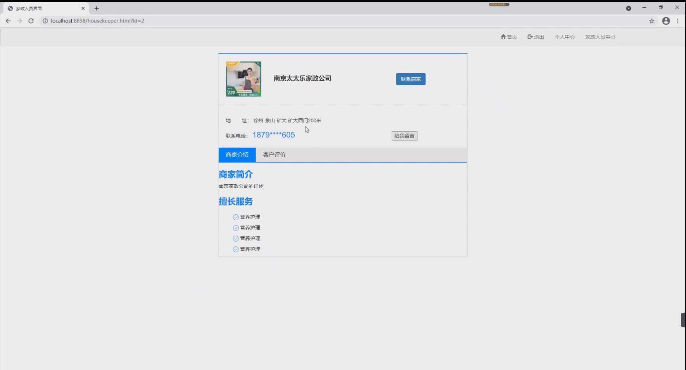
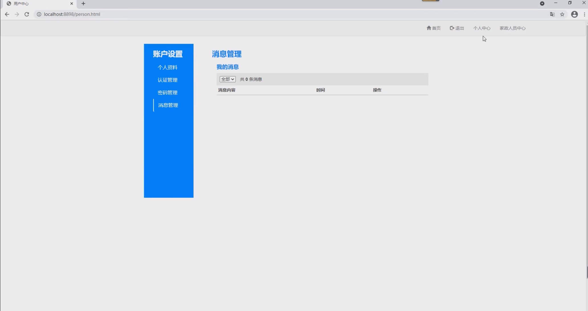
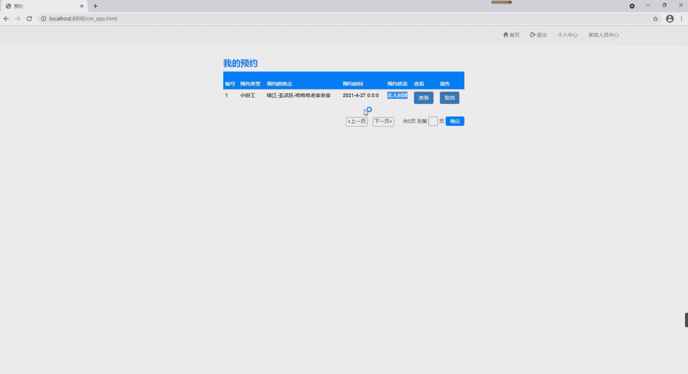

## 基于SSM框架的家政服务网站系统

- <b>完整代码获取地址：从戎源码网 ([https://armycodes.com/](https://armycodes.com/))</b>
- <b>技术探讨、资料分享，请加QQ群：692619798</b> 
- <b>作者微信：19941326836  QQ：952045282</b> 
- <b>承接计算机毕业设计、Java毕业设计、Python毕业设计、深度学习、机器学习</b>
- <b>选题+开题报告+任务书+程序定制+安装调试+论文+答辩ppt 一条龙服务</b>
- <b>所有选题地址 ([https://github.com/YuLin-Coder/AllProjectCatalog](https://github.com/YuLin-Coder/AllProjectCatalog)) </b>

## 项目介绍
基于SSM框架的家政服务网站系统，系统分为家政人员，普通用户，以及最高管理员三个角色，主要功能如下
1.用户的注册、登录、退出系统  
2.用户的个性化推荐（基于物品的协同过滤）  
3.家政人员上传资料、身份认证和资格认证  
4.消费者发布预约、查看预约、确认预约、评价订单、删除订单、修改个人资料  
5.家政人员修改个人资料、申请预约、接受订单、取消订单、完成订单  
6.管理员对用户认证管理和系统的量化查看 

## 项目技术
- 编程语言：Java
- 数据库：MySQL
- 前端技术：HTML、CSS、JavaScript、Jquery、bootstrap
- 后端技术：Spring、SpringMVC、MyBatis

## 运行环境
- JDK版本：JDK1.8及以上
- 开发工具：IDEA、Ecplise、Myecplise都可以
- 数据库: MySQL5.7及以上
- Maven：maven3.0及以上

## 运行截图

