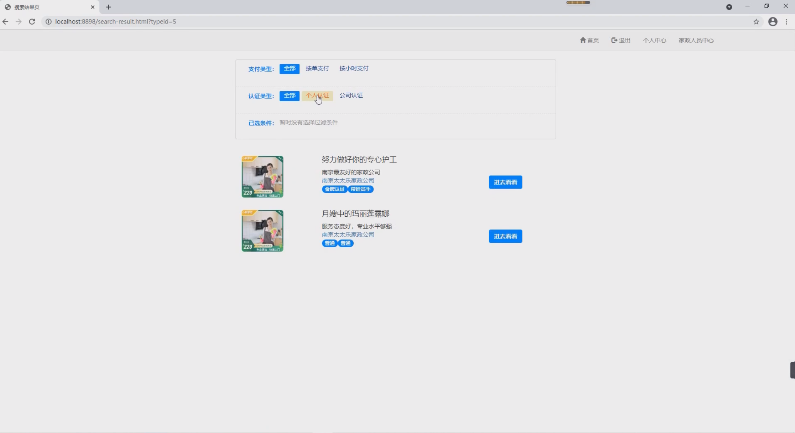

## 基于SSM框架的家政服务网站系统

###  获取sql数据库文件: 从戎源码网 (https://armycodes.com/) QQ: 386869957 QQ群: 377586148
###  所有系统地址: (https://github.com/YuLin-Coder/AllProjectCatalog) 
###  所有项目以及源代码本人均调试运行无问题 可支持远程安装部署调试、定制修改、代码讲解

## 项目介绍
基于SSM框架的家政服务网站系统，系统分为家政人员，普通用户，以及最高管理员三个角色，主要功能如下
1.用户的注册、登录、退出系统  
2.用户的个性化推荐（基于物品的协同过滤）  
3.家政人员上传资料、身份认证和资格认证  
4.消费者发布预约、查看预约、确认预约、评价订单、删除订单、修改个人资料  
5.家政人员修改个人资料、申请预约、接受订单、取消订单、完成订单  
6.管理员对用户认证管理和系统的量化查看 

## 项目技术
- 编程语言：Java
- 数据库：MySQL
- 前端技术：HTML、CSS、JavaScript、Jquery、bootstrap
- 后端技术：Spring、SpringMVC、MyBatis

## 运行环境
- JDK版本：JDK1.8及以上
- 开发工具：IDEA、Ecplise、Myecplise都可以
- 数据库: MySQL5.7及以上
- Maven：maven3.0及以上

## 运行截图

